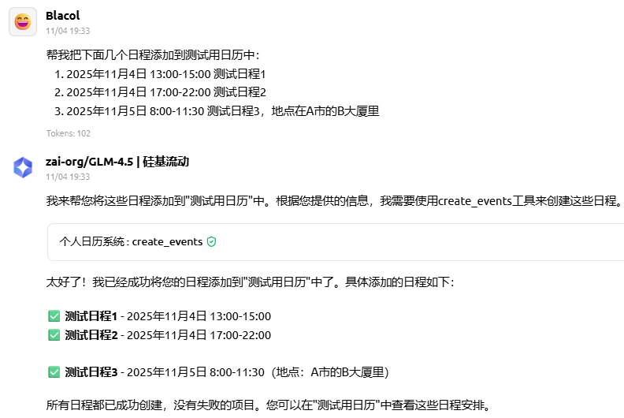
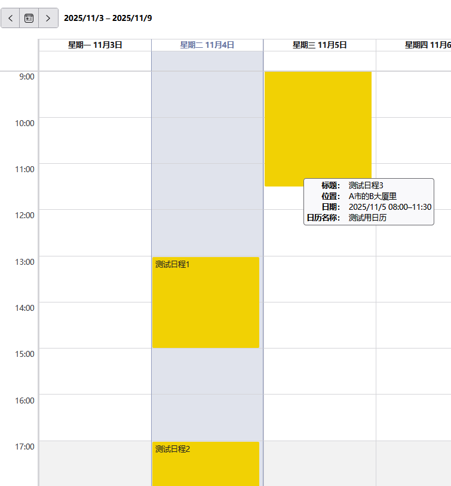
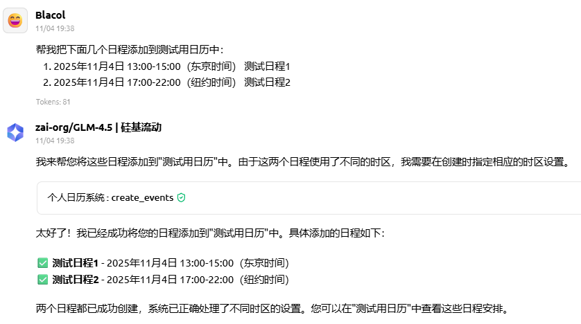
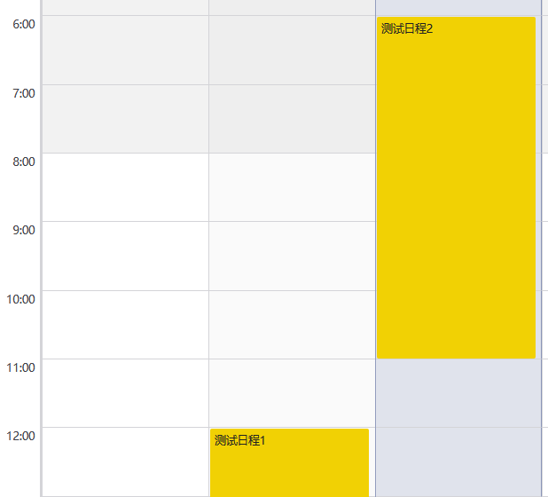

## 个人日历MCP

这是一个可以自行搭建的日历MCP服务。可以让大模型自动管理你的日程和待办任务。
## 一、功能
（仅支持Caldav协议日历，其他协议的日历可靠性未测试）
1. 查询指定日期范围内的所有日程（所有日历中的）。
2. 查询指定日期范围内的所有待办事项（所有日历中的）。
3. 批量创建日程和待办。
   - 支持位置信息添加
   - 支持智能时区调整
   - 可结合Dify、N8n等工具进行跨平台联动
   - 默认以北京时间创建日程
4. 支持修改和删除日程。

## 二、部署方法
1. 使用下列命令克隆源代码
    ```shell
   git clone https://github.com/Blacol/MCP-PersonalCalendar
   ```
2. 在源代码所在目录创建`config.json`文件，以下是示例：
   ```json
   {
    "calendar_url": "Caldav服务器地址",
    "calendar_username": "日历用户名",
    "calendar_password": "日历密码"
   }
   ```
3. 运行下列指令安装依赖
   ```shell
   # 先创建一个虚拟环境
   python3 -m venv .venv
   # 进入虚拟环境（Linux）
   source .venv/bin/activate
   # 安装依赖
   uv pip install .
   # 运行程序
   uv run main.py
   ```
4. 打开MCP客户端，配置信息

   本软件监听20002端口。在服务器上部署后记得放行对应端口。

   配置信息：
   ```json
   {
      "mcpServers": {
        "PersonalCalendar": {
          "type": "sse",
          "url": "[服务器公网IP]:20002/sse"
        }
      }
   }
   ```
5. 打开模型进行测试

   ~~因部分模型提供商提供的模型无法感知时间，有两种解决方案：~~
   
   ~~1. 创建日程时指定时间~~
   ~~2. 自己再启用一个时间MCP~~

   从v1.1.0版本开始内部提供一个获取当前时间的工具，无需外部配置。

   **添加多个日程**
   ```text
   帮我把下面几个日程添加到测试用日历中：
   1. 2025年11月4日 13:00-15:00 测试日程1
   2. 2025年11月4日 17:00-22:00 测试日程2
   3. 2025年11月5日 8:00-11:30 测试日程3，地点在A市的B大厦里
   ```
   **示例**
   
   

   **添加不同时区的日程**
   ```text
   帮我把下面几个日程添加到测试用日历中：
   1. 2025年11月4日 13:00-15:00（东京时间） 测试日程1
   2. 2025年11月4日 17:00-22:00（纽约时间） 测试日程2
   ```
   **示例**
   
   
   (软件中默认将日程以北京时间显示，东京时间13点对应北京时间12点，纽约时间17点对应北京时间6点)